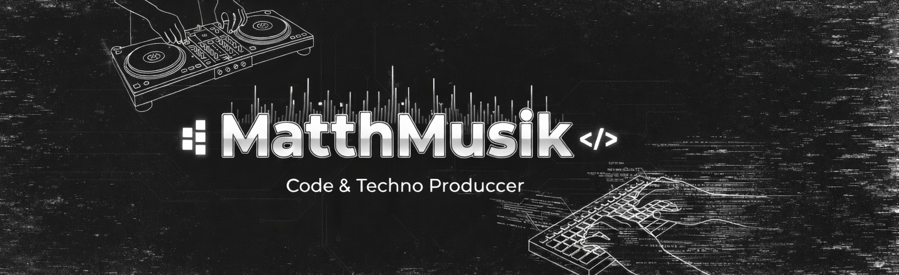

  

# ¡Hola! Soy MatthMusik 👋

### 🎶 Estudiante de Programación & Techno Producer
Me apasiona el mundo del código y cómo la tecnología se mezcla con la música.

- 🔭 Actualmente enfocado en: Fortalecer mis bases en algoritmos y lógica.
- 🌱 Estoy aprendiendo: Java y Python.
- 💬 Pregúntame sobre: Música techno, producción o mis primeros pasos en dev.
- 📫 Cómo contactarme: mateoduque92@gmail.com

### 🛠️ Tecnologías que estoy dominando

### 📈 Mis Estadísticas de GitHub

